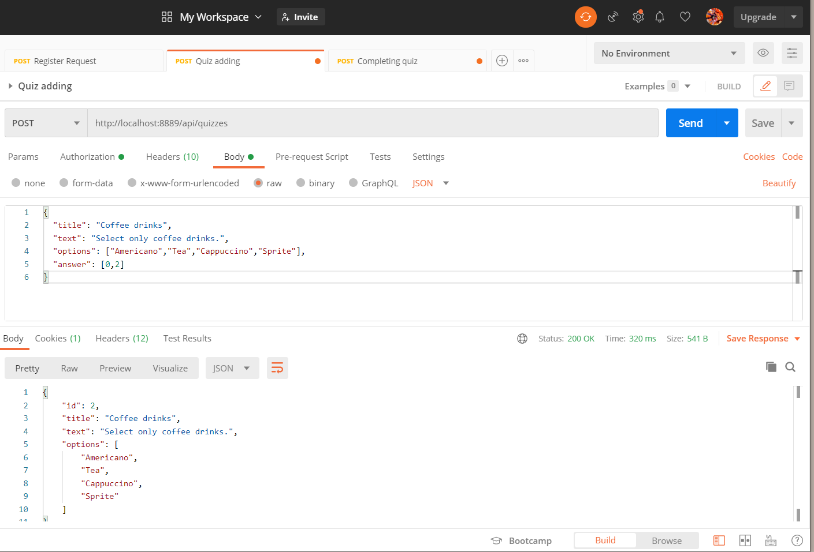
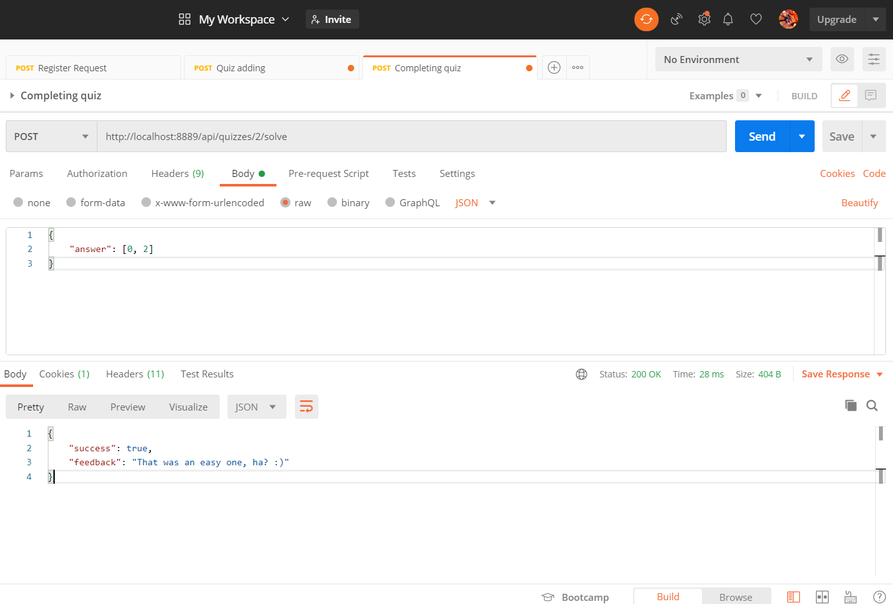

# Web-Quiz-Engine-Maven - Education project of Hyperskill.org

Web Quiz Engine is an engine for creating/solving/deleting quizzes by multiple authorized (HTTP Basic) users. 
This project is built on REST principles and uses Spring Boot framework and its embedded H2 database for storing quizzes and users. 
JSON is used for transmitting objects between a client and a server.

/api/register:

    POST: Register a user.

Register

 
 
 
 
/api/quizzes:

    POST: Create a quiz.

    GET: Get all quizzes.

Quiz Adding
 

/api/quizzes/{id}/solve:

    POST: Solve quiz with recieved quiz's id.
    
Completing quiz   
 
  
  
  api/{id}:
  
     GET: Get quiz by id.
        
     DELETE: Delete quiz by user's id.
 
  
 
 
 
 
 
 
 
 
 
 
 
 
 
 
 
 
 
 
 
 
 
 
 
 
 
 
 
 
 
 
 
 
 
 
 
 
 
 
 
 
 
 
 
 
 
 
 
 
 
 
 
 
 
 
 
 
 
 
 
 
 
 
 
 
 
 
 
 
 
 
 
 
 
 
 
 
 
 
 
 
 
 
 
 
 
 
 
 
 
 
 
 
 
 
 
 
 
 
 
 
 
 
 
 
 
 
 
 
 
 
 
 
 
 
 
 
 
 
 
 
 
 
 
 
 
 
 
 
 
 
 
 
 
 
 
 
 
 
 
 
 
 
 
 
 
 
 
 
 
 
 
 
 
 
 
 
 
 
