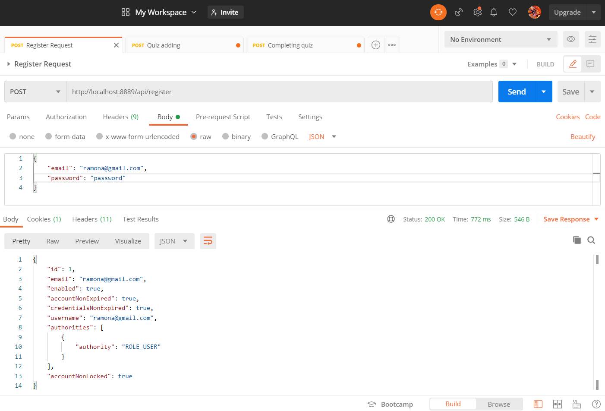
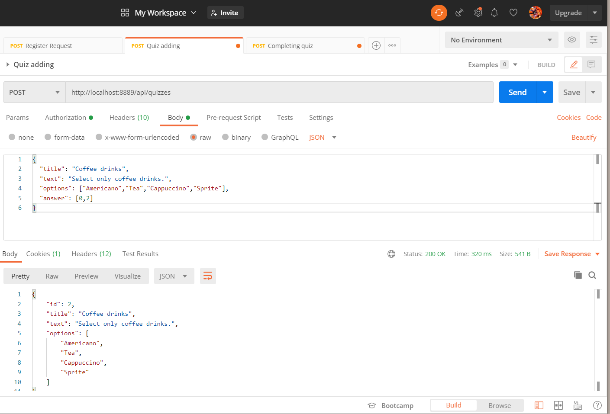
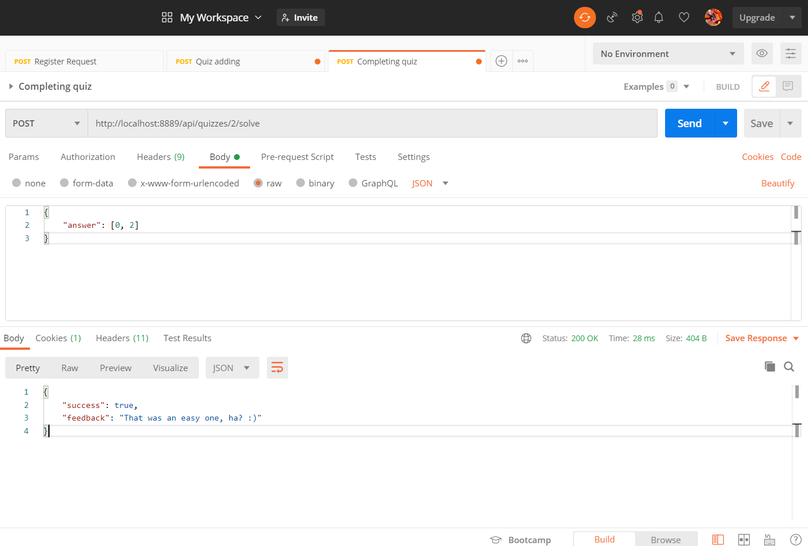

# Web-Quiz-Engine-Maven

Web Quiz Engine It is an engine for creating/solving/deleting quizzes by multiple authorized (HTTP Basic) users. This project built on REST principles and uses Spring Boot framework and its embedded H2 database for storing quizzes and users. JSON is used for transmitting objects between a client and a server.

API:

/api

/quizzes:

    POST: Create a quiz.

    GET: Get all quizzes.
 
 Register
 
 

/quizzes:
 POST: Create a quiz.
 GET: Get all quizzes.
 
 
 Create a quiz
 
 
 
 
/solve:
    POST: Solve quiz with recieved quiz's id.
    
   
   Completing quiz
   
  
  
 
  
 
 
 
 
 
 
 
 
 
 
 
 
 
 
 
 
 
 
 
 
 
 
 
 
 
 
 
 
 
 
 
 
 
 
 
 
 
 
 
 
 
 
 
 
 
 
 
 
 
 
 
 
 
 
 
 
 
 
 
 
 
 
 
 
 
 
 
 
 
 
 
 
 
 
 
 
 
 
 
 
 
 
 
 
 
 
 
 
 
 
 
 
 
 
 
 
 
 
 
 
 
 
 
 
 
 
 
 
 
 
 
 
 
 
 
 
 
 
 
 
 
 
 
 
 
 
 
 
 
 
 
 
 
 
 
 
 
 
 
 
 
 
 
 
 
 
 
 
 
 
 
 
 
 
 
 
 
 
